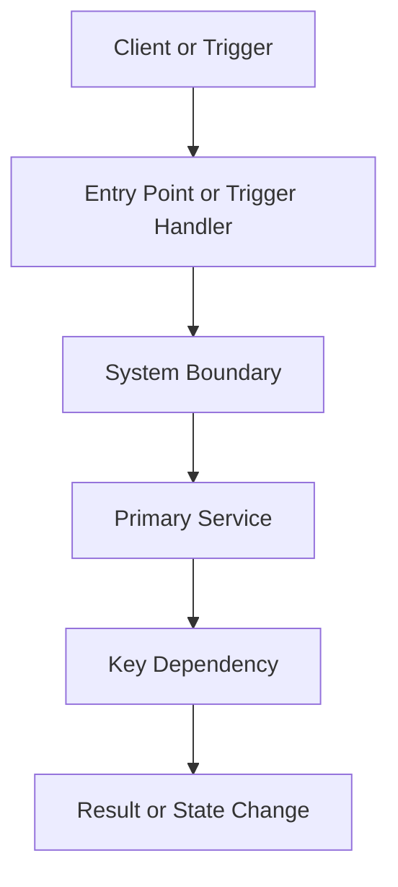
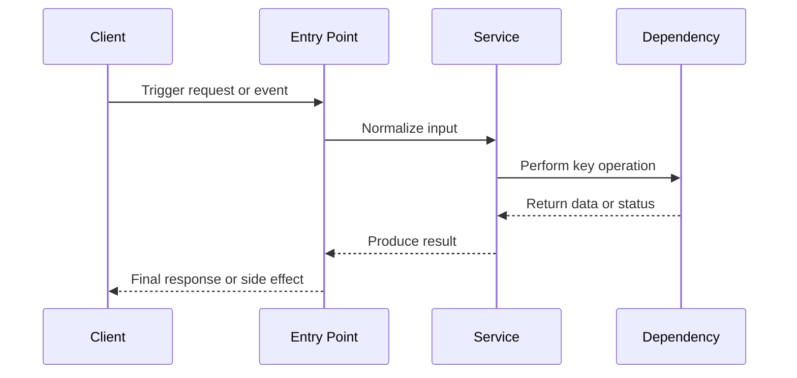
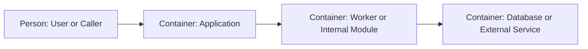

# <Topic Title>

## Why This Exists
- Summarize why this implementation matters and when an engineer would read this artifact.
- State the scope boundary so adjacent systems are not confused as part of the same flow.

## Executive Summary
- Explain the implementation in 3-5 bullets.
- Separate confirmed behavior from inferred behavior.

## Primary Entry Points
- List the user-facing, API, CLI, scheduler, or event entrypoints.
- Cite the exact repo files that initiate the flow.

## Key Files And Responsibilities
- For each file, explain its role in one sentence.
- Prefer the smallest set of files that makes the design understandable.

## End-To-End Flow
1. Describe the trigger.
2. Describe the first hop.
3. Describe the major control-flow branches.
4. Describe how state or data changes.
5. Describe where the flow ends or returns.

## Mermaid: Request, Data, Or Control Flow

## Mermaid: Sequence View

## C4-Style View

- Label each node with the real system name from the repo.
- Keep this focused on actors and containers, not every function call.

## State, Rules, And Constraints
- Capture business rules, guard clauses, retries, caching, idempotency, and ordering constraints.
- Mark anything that is inferred instead of directly evidenced.

## Extension Points
- List the interfaces, hooks, config, or branch points an engineer would modify.
- Call out high-risk files where changes would have broad impact.

## Risks And Unknowns
- List any unclear behavior, unverified runtime assumptions, or missing tests.
- Be explicit when more investigation is needed.

## Sample Questions For Future Exploration
- "What breaks if this dependency fails?"
- "Where should a new variant plug into this flow?"
- "Which tests give the best coverage for this implementation?"

## Artifact Metadata
- Suggested artifact path: `.agents/artifacts/<topic-slug>.md`
- Use one topic-specific file per implementation area.
- Keep citations inline with the explanation using repo file paths and line ranges.
