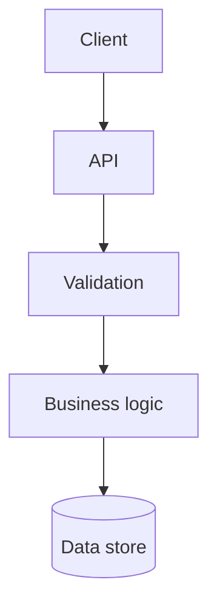

# Termaid

Use `termaid` to render **standard Mermaid** syntax while planning, implementing, or reviewing a change.

## Planning Requirement

Every proposed plan response must include three compact standard Mermaid diagrams, each rendered with `uvx --offline termaid --ascii` through stdin or a safe temporary file, shown in this order under these exact headings:

1. `Before` - current flow, ownership, or state the plan touches.
2. `After` - proposed flow once the plan is done.
3. `What changed` - only the added, removed, or modified pieces, grouped by file or component.

Inspect each render, then paste each renderer output into chat verbatim, character for character, inside a fenced block; never redraw, re-space, abbreviate, or hand-tidy it. If a render is too wide or unclear, change the Mermaid source and re-render instead. Do not show raw Mermaid source unless user asks. Do not request approval if any render fails.

After approval, persist exact inspected Mermaid source for all three diagrams in `plan.md`. `agent-taskctl validate` renders every Mermaid block offline; it must pass before implementation.

Keep `tasks.md` diagram-free; it tracks actionable work only.

## When to Visualize Before and After

For implementation or review, create separate compact before-and-after diagrams when a non-trivial change affects any of these:

- Request, event, or data flow across components.
- Ownership or dependency boundaries.
- State transitions, asynchronous work, or failure paths.
- Database, service, or deployment topology.

Skip before-and-after diagrams for a local, obvious implementation or review change whose control flow and boundaries do not change. This skip never applies to proposed plan responses; those always use the `Before`, `After`, `What changed` format.

## Diagram Guidance

- Keep diagrams compact: show only components, boundaries, and transitions needed to explain the decision.
- Prefer top-down flowcharts with `flowchart TD`.
- Use stable, human-readable node labels.
- Show the **before** and **after** diagrams separately when behavior or ownership changes.
- Do not use diagrams to invent architecture; match the current system and proposed scope.
- Keep Mermaid source in a fenced `mermaid` block in the conversation or relevant documentation.

Example:



## Commands

Render offline from stdin; this never installs or accesses network:

```bash
uvx --offline termaid --ascii
```

## Interactive Workflow

### Planning

Follow `Planning Requirement` above; revise each source until its render accurately communicates the plan.

### Implementation and Review

1. Write the smallest standard Mermaid diagram that captures the current flow.
2. Render and inspect it with `uvx --offline termaid --ascii`.
3. Update the Mermaid source to represent the proposed flow.
4. Render with `uvx --offline termaid --ascii` again to compare after-change diagram.
5. Keep only the diagram that improves implementation, review, or documentation clarity.

Do not modify implementation solely to make a diagram prettier.
