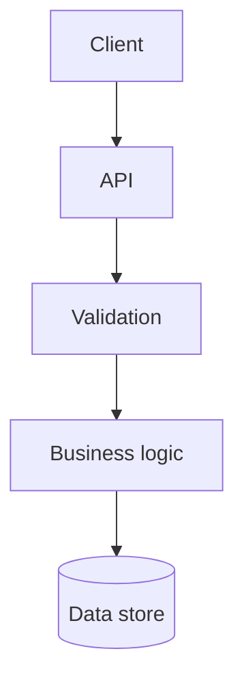

# Termaid

Use `termaid` to render **standard Mermaid** syntax while planning, implementing, or reviewing a change.

## Planning Requirement

Every planning conversation must include at least one compact standard Mermaid diagram in `plan.md` and must render and inspect it with `termaid`.

Keep `tasks.md` diagram-free; it tracks actionable work only.

## When to Visualize Before and After

For implementation or review, create separate compact before-and-after diagrams when a non-trivial change affects any of these:

- Request, event, or data flow across components.
- Ownership or dependency boundaries.
- State transitions, asynchronous work, or failure paths.
- Database, service, or deployment topology.

Skip before-and-after diagrams for a local, obvious implementation or review change whose control flow and boundaries do not change.

## Diagram Guidance

- Keep diagrams compact: show only components, boundaries, and transitions needed to explain the decision.
- Prefer top-down flowcharts with `flowchart TD`.
- Use stable, human-readable node labels.
- Show the **before** and **after** diagrams separately when behavior or ownership changes.
- Do not use diagrams to invent architecture; match the current system and proposed scope.
- Keep Mermaid source in a fenced `mermaid` block in the conversation or relevant documentation.

Example:



## Commands

Inspect the installed command surface before relying on a version-specific option:

```bash
uvx termaid --help
```

Launch the interactive termaid workflow with Mermaid source available to inspect or edit:

```bash
uvx termaid
```

Use the renderer command and options reported by the installed version for file-based output:

```bash
uvx termaid render --help
```

## Interactive Workflow

### Planning

1. Write the smallest standard Mermaid diagram that captures the planned flow, scope, or dependencies in `plan.md`.
2. Invoke `uvx termaid` and render or inspect that diagram interactively.
3. Update the Mermaid source until the rendered diagram accurately communicates the plan.
4. Keep the inspected Mermaid diagram in `plan.md`; keep `tasks.md` diagram-free.

### Implementation and Review

1. Write the smallest standard Mermaid diagram that captures the current flow.
2. Invoke `uvx termaid` and render or inspect that diagram interactively.
3. Update the Mermaid source to represent the proposed flow.
4. Invoke `uvx termaid` again to compare the after-change diagram.
5. Keep only the diagram that improves implementation, review, or documentation clarity.

Do not modify implementation solely to make a diagram prettier.
