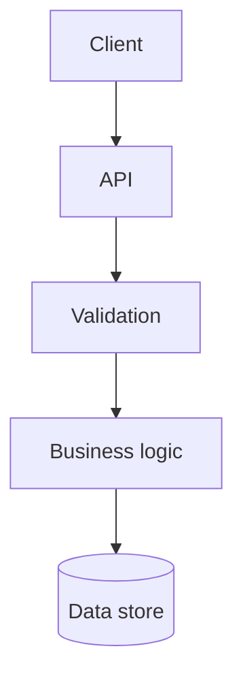

# Termaid

Use `termaid` to render **standard Mermaid** syntax while planning, implementing, or reviewing a change.

## Planning Requirement

Before requesting approval for a non-trivial plan, draft at least one compact standard Mermaid diagram and render it with `uvx --offline termaid --ascii` through stdin or a safe temporary file. Inspect result, then show rendered Termaid output in chat; do not show raw Mermaid source unless user asks. Do not request approval if rendering fails.

After approval, persist exact inspected Mermaid source in `plan.md`. `agent-taskctl validate` renders every Mermaid block offline; it must pass before implementation.

Keep `tasks.md` diagram-free; it tracks actionable work only.

## When to Visualize Before and After

For implementation or review, create separate compact before-and-after diagrams when a non-trivial change affects any of these:

- Request, event, or data flow across components.
- Ownership or dependency boundaries.
- State transitions, asynchronous work, or failure paths.
- Database, service, or deployment topology.

Skip before-and-after diagrams for a local, obvious implementation or review change whose control flow and boundaries do not change.

## Diagram Guidance

- Keep diagrams compact: show only components, boundaries, and transitions needed to explain the decision.
- Prefer top-down flowcharts with `flowchart TD`.
- Use stable, human-readable node labels.
- Show the **before** and **after** diagrams separately when behavior or ownership changes.
- Do not use diagrams to invent architecture; match the current system and proposed scope.
- Keep Mermaid source in a fenced `mermaid` block in the conversation or relevant documentation.

Example:



## Commands

Render offline from stdin; this never installs or accesses network:

```bash
uvx --offline termaid --ascii
```

## Interactive Workflow

### Planning

1. Draft smallest standard Mermaid diagram that captures plan flow, scope, or dependencies.
2. Pipe source to `uvx --offline termaid --ascii`, then inspect rendered output.
3. Update source until rendered diagram accurately communicates plan.
4. Show rendered output—not source—in approval request.
5. After approval, keep exact inspected Mermaid source in `plan.md`; keep `tasks.md` diagram-free.

### Implementation and Review

1. Write the smallest standard Mermaid diagram that captures the current flow.
2. Render and inspect it with `uvx --offline termaid --ascii`.
3. Update the Mermaid source to represent the proposed flow.
4. Render with `uvx --offline termaid --ascii` again to compare after-change diagram.
5. Keep only the diagram that improves implementation, review, or documentation clarity.

Do not modify implementation solely to make a diagram prettier.
