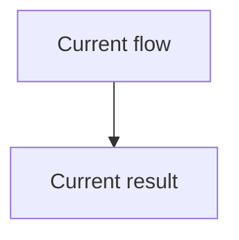
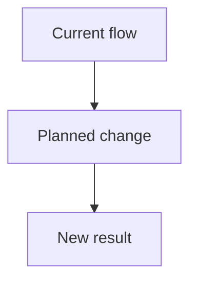
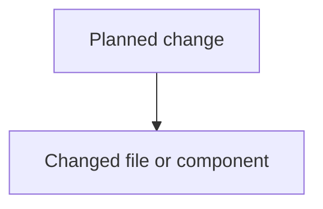

# Plan Mode Tasks

## Pi Plan Mode

- Keep Plan Mode strictly read-only: inspect files and prepare the plan in chat without creating or editing repository files.
- After the user explicitly approves the plan, create or update `plan.md` and `tasks.md` as requested.
- Keep implementation work and repository changes outside Plan Mode and only after approval.

## Intent

- Create and maintain plan artifacts in directory user requests; default to `./.agents/tasks/<task>/` whenever Plan Mode plan is produced.
- Use the stdlib CLI at `scripts/agent-taskctl.py` for repeatable artifact creation, status, checkbox progress, validation, archive, and restore operations.

## Permission Gate

- During Plan Mode, do not create, edit, delete, move, archive, restore, or otherwise mutate files.
- If approval is denied, provide planned contents in chat only.
- After explicit approval, writes to `plan.md` and `tasks.md` are permitted within the approved scope.
- Read-only status, list, next, and validate operations remain permitted without renewed approval.
- Checkbox progress updates are writes and require prior approval unless the user has explicitly approved progress tracking.
- Ask for renewed approval before changing approved plan content or regenerating `tasks.md` from revised plan steps.

## Task Slugging

- Derive `<task>` from user's task title or primary request text.
- Transform to lowercase.
- Replace whitespace with hyphens.
- Remove non-alphanumeric characters except hyphens.
- Trim leading and trailing hyphens.
- If no clear task title exists, ask user for short task name before proceeding.

## Files

### `plan.md`

Use this template and fill it with final plan content.

````md
# Goal

# Scope

# Non-goals

# Constraints

# Plain-English Pseudocode

```text
Retrieve [raw source data] from [source boundary].
Prepare [raw source data] into [primitive inputs].
Validate [primitive inputs] into [validated primitive inputs] or [validation errors].
Compute [business result] from [validated primitive inputs].
Build [output value] from [business result].
Return [output value] without mutating inputs.
```

# Plan

# Risks

# Tests

## Before



## After



## What changed


````

- Diagram content and format come from the `termaid` skill's `Planning Requirement`; this skill only persists the approved Mermaid source in `plan.md` and keeps `tasks.md` Mermaid-free.

### `tasks.md`

- Use checkbox list format.
- Seed tasks from Plan steps, one task per line.
- Add nested `Pseudo:` blocks under each implementation-heavy or behavior-changing task.
- Write every `Pseudo:` value as a fenced `text` code block with one plain-English flow step per line.
- Add nested `Verify:` acceptance checks under each task when the plan includes tests, constraints, invariants, risks, docs, samples, config changes, or source-specific behavior.
- Keep `Verify:` checks concrete enough to prove completion; include critical success, failure, no-write/no-mutation, rollback/no-cleanup, path preservation, docs/sample, and source-specific coverage where relevant.
- Do not make `tasks.md` a broad checklist that can be marked done without proof.
- Use this format:

````md
- [ ] Task description
  - Pseudo:
    ```text
    Collect [task inputs].
    Normalize [task inputs] into [task-ready inputs].
    Build [task output] from [task-ready inputs].
    Verify [task output] preserves [key invariant].
    ```
  - Verify: Acceptance check tied to plan tests, constraints, or risks.
````

## Plain-English Pseudocode

- For code-change plans, include `# Plain-English Pseudocode` in `plan.md`; do not omit it.
- Make pseudocode substantial enough to guide implementation, test selection, and review.
- Write pseudocode inside a fenced `text` code block.
- Use multiline flow format: one domain step per line, in execution order.
- For code-change plans, show separate data retrieval, data preparation, validation, and pure business-logic stages when business behavior is involved.
- Write pseudocode as domain steps in execution order.
- Prefer immutable flow: each step should produce a named output consumed by the next step.
- Keep it behavior-focused, not language-specific.
- Name key invariants when behavior must not change.

Use this shape:

```text
Retrieve [raw source data] from [source boundary].
Prepare [raw source data] into [primitive inputs].
Validate [primitive inputs] into [validated primitive inputs] or [validation errors].
Compute [business result] from [validated primitive inputs].
Build [output value] from [business result].
Return [output value] without mutating inputs.
```

For each implementation-heavy or behavior-changing task, add a nested `Pseudo:` block in `tasks.md`:

````md
- [ ] Refactor consumption row build into billing, seat, and pricing stages.
  - Pseudo:
    ```text
    Retrieve raw consumption records from the usage source.
    Prepare raw consumption records into primitive usage inputs.
    Validate primitive usage inputs into valid usage inputs or validation errors.
    Compute billing rows from valid usage inputs and pricing primitives.
    Compute seat rows from valid usage inputs and seat-count primitives.
    Build enriched rows from billing rows, seat rows, and pricing results.
    Return valid-email rows with existing public behavior preserved.
    ```
  - Verify: focused tests pass and public behavior stays unchanged.
````

## Updates

- If plan changes, ask for approval again before updating `plan.md` or `tasks.md`.
- Keep `tasks.md` aligned to current Plan steps.
- Progress updates may toggle only top-level checkbox markers in `tasks.md`; preserve nested Markdown and unrelated text.

## Collisions

- If `./.agents/tasks/<task>/` already exists, reuse it and update `plan.md` and `tasks.md`.

## CLI

Use `$HOME/.pi/agent/skills/plan-mode-tasks/scripts/agent-taskctl.py` for all CLI operations.

```text
python3 "$HOME/.pi/agent/skills/plan-mode-tasks/scripts/agent-taskctl.py" --root <workspace> init <slug>
python3 "$HOME/.pi/agent/skills/plan-mode-tasks/scripts/agent-taskctl.py" --root <workspace> write-plan <slug> < plan.md
python3 "$HOME/.pi/agent/skills/plan-mode-tasks/scripts/agent-taskctl.py" --root <workspace> write-tasks <slug> < tasks.md
python3 "$HOME/.pi/agent/skills/plan-mode-tasks/scripts/agent-taskctl.py" --root <workspace> list
python3 "$HOME/.pi/agent/skills/plan-mode-tasks/scripts/agent-taskctl.py" --root <workspace> list --archived
python3 "$HOME/.pi/agent/skills/plan-mode-tasks/scripts/agent-taskctl.py" --root <workspace> list --done
python3 "$HOME/.pi/agent/skills/plan-mode-tasks/scripts/agent-taskctl.py" --root <workspace> list --complete
python3 "$HOME/.pi/agent/skills/plan-mode-tasks/scripts/agent-taskctl.py" --root <workspace> list --completed
python3 "$HOME/.pi/agent/skills/plan-mode-tasks/scripts/agent-taskctl.py" --root <workspace> list --open
python3 "$HOME/.pi/agent/skills/plan-mode-tasks/scripts/agent-taskctl.py" --root <workspace> list --doing
python3 "$HOME/.pi/agent/skills/plan-mode-tasks/scripts/agent-taskctl.py" --root <workspace> status <slug>
python3 "$HOME/.pi/agent/skills/plan-mode-tasks/scripts/agent-taskctl.py" --root <workspace> status <slug> --next
python3 "$HOME/.pi/agent/skills/plan-mode-tasks/scripts/agent-taskctl.py" --root <workspace> status <slug> --all
python3 "$HOME/.pi/agent/skills/plan-mode-tasks/scripts/agent-taskctl.py" --root <workspace> status <slug> --todo
python3 "$HOME/.pi/agent/skills/plan-mode-tasks/scripts/agent-taskctl.py" --root <workspace> status <slug> --done
python3 "$HOME/.pi/agent/skills/plan-mode-tasks/scripts/agent-taskctl.py" --root <workspace> next <slug>
python3 "$HOME/.pi/agent/skills/plan-mode-tasks/scripts/agent-taskctl.py" --root <workspace> check <slug> <task-number>
python3 "$HOME/.pi/agent/skills/plan-mode-tasks/scripts/agent-taskctl.py" --root <workspace> uncheck <slug> <task-number>
python3 "$HOME/.pi/agent/skills/plan-mode-tasks/scripts/agent-taskctl.py" --root <workspace> validate <slug>
python3 "$HOME/.pi/agent/skills/plan-mode-tasks/scripts/agent-taskctl.py" --root <workspace> archive <slug>
python3 "$HOME/.pi/agent/skills/plan-mode-tasks/scripts/agent-taskctl.py" --root <workspace> restore <slug>
```

- `--root` is optional and defaults to current working directory.
- Artifacts live at `<root>/.agents/tasks/<slug>/plan.md` and `<root>/.agents/tasks/<slug>/tasks.md`.
- Archives move task directories to `<root>/.agents/tasks/.archive/<slug>`.
- `list` shows active task slugs; `list --archived` shows archived task slugs.
- `list --done`, `list --complete`, and `list --completed` show active task slugs where all top-level `tasks.md` checkbox lines are checked.
- `list --open` and `list --doing` show active task slugs where at least one top-level `tasks.md` checkbox line is unchecked.
- `list` state filters ignore nested checkbox lines, matching the `status`, `check`, and `uncheck` top-level task parser.
- `list` state filters return an error when any active task directory has missing or invalid `tasks.md`; default `list` does not inspect artifact content.
- `list --archived` and all `list` state-filter aliases are mutually exclusive.
- `restore` moves `<root>/.agents/tasks/.archive/<slug>` back to `<root>/.agents/tasks/<slug>` without overwriting active tasks.
- Slugs must be lowercase letters, numbers, and single hyphens; dots, slashes, leading hyphens, and trailing hyphens are invalid.
- `init` creates template-compatible files and does not overwrite existing `plan.md` or `tasks.md`.
- `write-plan` and `write-tasks` read non-empty stdin and write atomically.
- `status <slug>` shows checked count and next unchecked task; `status <slug> --next` is an exact alias.
- `status <slug> --all` shows checked count and every top-level task in source order.
- `status <slug> --todo` shows checked count and unchecked top-level tasks with original 1-based numbers; empty result prints `todo:` then `none`.
- `status <slug> --done` shows checked count and checked top-level tasks with original 1-based numbers; empty result prints `done:` then `none`.
- `--next`, `--all`, `--todo`, and `--done` are mutually exclusive status filters and may appear before or after `<slug>`.
- `check` and `uncheck` use 1-based top-level task numbers and preserve all unrelated Markdown.
- `validate` checks required plan headings, non-empty fenced `text` pseudocode in `plan.md`, the three rendered fenced Mermaid blocks the termaid `Planning Requirement` asks for in `plan.md`, top-level checkbox task lines, nested `Verify:` lines, and any present nested `Pseudo:` fenced `text` blocks.

## Lifecycle

1. Confirm approved plan and slug.
2. Run `python3 "$HOME/.pi/agent/skills/plan-mode-tasks/scripts/agent-taskctl.py" --root <workspace> init <slug>` to create the task directory when needed.
3. Write approved `plan.md` with exact inspected Mermaid source and diagram-free `tasks.md` using `write-plan` and `write-tasks`.
4. Run `python3 "$HOME/.pi/agent/skills/plan-mode-tasks/scripts/agent-taskctl.py" --root <workspace> validate <slug>` before handing artifacts back.
5. Use `list` state filters, `status`, `status --next`, `status --all`, `status --todo`, `status --done`, and `next` to report progress without editing plan content.
6. Use `check` and `uncheck` only for proven progress updates on top-level task lines.
7. Use `archive` when parent agent or user says task artifacts should be moved out of active tasks.
8. Use `list --archived` to inspect archived tasks and `restore` when parent agent or user says archived artifacts should return to active tasks.
